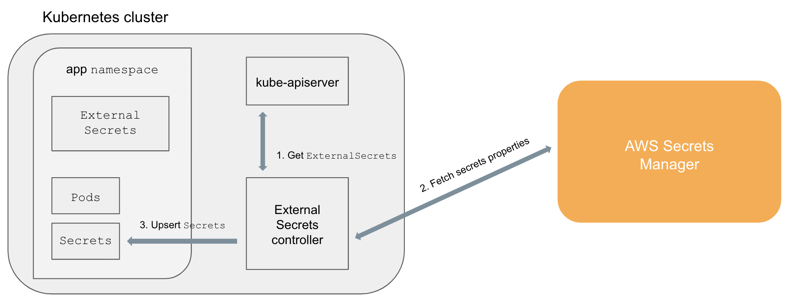
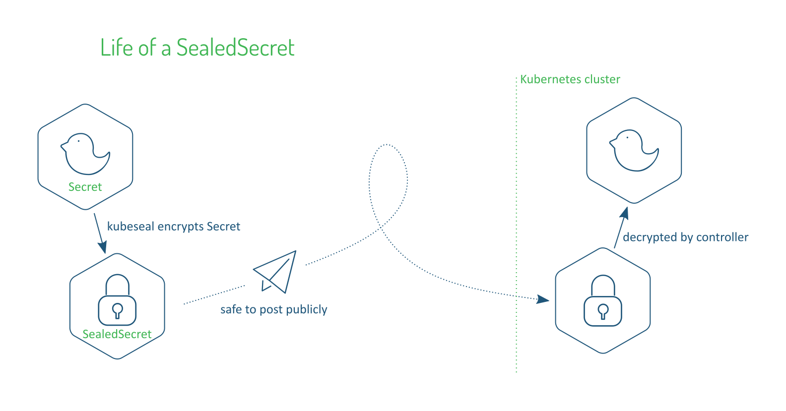

<!-- START doctoc generated TOC please keep comment here to allow auto update -->
<!-- DON'T EDIT THIS SECTION, INSTEAD RE-RUN doctoc TO UPDATE -->
**Table of Contents**  *generated with [DocToc](https://github.com/thlorenz/doctoc)*

- [Gitops manage secrets](#gitops-manage-secrets)
  - [Ways to manage secrets](#ways-to-manage-secrets)
    - [Vault or remote secrets manager (e.g AWS Secrets Manager)](#vault-or-remote-secrets-manager-eg-aws-secrets-manager)
    - [Encrypt and Decrypt by thirdparty tools](#encrypt-and-decrypt-by-thirdparty-tools)

<!-- END doctoc generated TOC please keep comment here to allow auto update -->

# Gitops manage secrets

## Ways to manage secrets

### Vault or remote secrets manager (e.g AWS Secrets Manager)

- [Kubernetes External Secrets](https://github.com/external-secrets/kubernetes-external-secrets)
- [External Secrets Operator](https://github.com/external-secrets/external-secrets)
- [Hashicorp Vault](https://www.vaultproject.io/)
- [Banzai Cloud Bank-Vaults](https://github.com/banzaicloud/bank-vaults) .. bypass etcd
- [aws-secret-operator](https://github.com/mumoshu/aws-secret-operator)
- [argocd-vault-plugin](https://github.com/IBM/argocd-vault-plugin) (avoiding thridparty controller or CRD)

**How it works ?** 

Dynamic injection of secrets stored in a key-management service, such as Vault or IBM Cloud Key Protect Services. The GitOps repository references secrets by name and the actual secret is pulled from the key- management service and mapped to a Secret resource in the target cluster.

Take kuberentes external Secrets as an example

1. ExternalSecrets are added in the cluster (e.g., kubectl apply -f external-secret-example.yml)
2. Controller fetches ExternalSecrets using the Kubernetes API
3. Controller uses ExternalSecrets to fetch secret data from external providers (e.g, AWS Secrets Manager)
4. Controller upserts Secrets
5. Pods can access Secrets normally

### Encrypt and Decrypt by thirdparty tools

- [Bitnami Sealed Secrets](https://github.com/bitnami-labs/sealed-secrets)
- [Helm secrets](https://github.com/jkroepke/helm-secrets)
- [Kustomize secret generator plugins](https://github.com/kubernetes-sigs/kustomize/blob/fd7a353df6cece4629b8e8ad56b71e30636f38fc/examples/kvSourceGoPlugin.md#secret-values-from-anywhere)
- [KSOPS](https://github.com/viaduct-ai/kustomize-sops#argo-cd-integration)

**Take sealedSecret as an example**

The SealedSecrets implementation consists of two components:

1. A controller that runs in-cluster, and implements a new SealedSecret Kubernetes API object via the "third party resource" mechanism.
2. A kubeseal command line tool that encrypts a regular Kubernetes Secret object (as YAML or JSON) into a SealedSecret.

Once decrypted by the controller, the enclosed Secret can be used exactly like a regular K8s Secret (it is a regular K8s Secret at this point!). If the SealedSecret object is deleted, the controller will garbage collect the generated Secret.