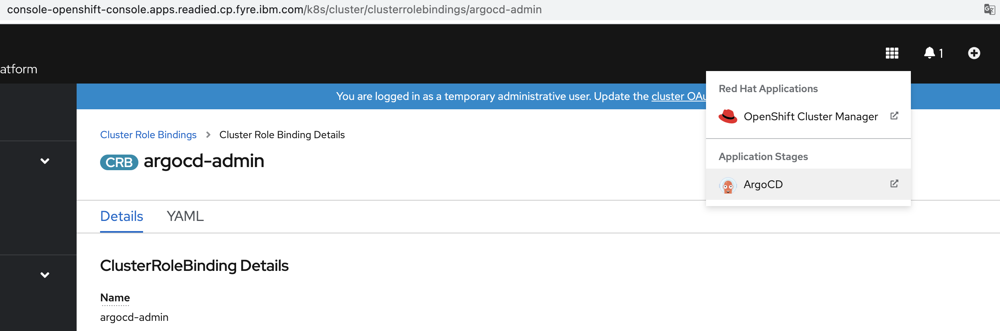

<!-- START doctoc generated TOC please keep comment here to allow auto update -->
<!-- DON'T EDIT THIS SECTION, INSTEAD RE-RUN doctoc TO UPDATE -->
**Table of Contents**  *generated with [DocToc](https://github.com/thlorenz/doctoc)*

- [Provision OCP cluster on Fyre](#provision-ocp-cluster-on-fyre)
  - [Prerequisite](#prerequisite)
  - [Provision OCP cluster](#provision-ocp-cluster)
    - [Option 1: Using the OCP console](#option-1-using-the-ocp-console)
      - [1. Grant Argo CD Enough Permissions](#1-grant-argo-cd-enough-permissions)
      - [2. Login to Argo CD](#2-login-to-argo-cd)
      - [3. Create a ArgoCD application for provison OCP cluster on fyre](#3-create-a-argocd-application-for-provison-ocp-cluster-on-fyre)
    - [Option 2: Using a terminal](#option-2-using-a-terminal)
      - [1. Grant Argo CD Enough Permissions](#1-grant-argo-cd-enough-permissions-1)
      - [2. Login to the Argo CD server](#2-login-to-the-argo-cd-server)
      - [3. Create a ArgoCD application for installing cp4waiops in-cluster](#3-create-a-argocd-application-for-installing-cp4waiops-in-cluster)
  - [Verify OCP Cluster on Fyre](#verify-ocp-cluster-on-fyre)
    - [CLI Verify](#cli-verify)
    - [UI Verify](#ui-verify)

<!-- END doctoc generated TOC please keep comment here to allow auto update -->


# Provision OCP cluster on Fyre

## Prerequisite

- OCP 4.8 + 
- Install gitops operator(Red Hat OpenShift GitOps) in ocp operator-hub

## Provision OCP cluster

### Option 1: Using the OCP console

#### 1. Grant Argo CD Enough Permissions

From the Red Hat OpenShift OLM UI, go to **User Management** > **RoleBindings** > **Create binding**.

Use the Form view to configure the properties for the **ClusterRoleBinding**, and select the Create button.

```
Binding type: Cluster-wide role binding (ClusterRoleBinding)

RoleBinding
Name: argocd-admin

Role
Role Name: cluster-admin

Subject
ServiceAccount:  tick it
Subject namespace: openshift-gitops
Subject name: openshift-gitops-argocd-application-controller
```

#### 2. Login to Argo CD

Login ArgoCD entrance

   

Login Username/Password
```
Username: admin  
Password: Please copy the Data value of secret "openshift-gitops-cluster" in namespace "openshift-gitops"
```

You can use following command to get the password:

```
oc get secret openshift-gitops-cluster -n openshift-gitops -ojsonpath='{.data.admin\.password}' | base64 -d; echo
```

 

#### 3. Create a ArgoCD application for provison OCP cluster on fyre

```
GENERAL
Application Name: anyname(like "ocp")
Project: default
SYNC POLICY: Automatic

SOURCE
REPO URL : https://github.com/cloud-pak-gitops/community
Target version: HEAD
path: e2e

DESTINATION
Cluster URL: https://kubernetes.default.svc
Namespace: default

HELM
spec.fyreUsername: your_fyreUsername
spec.fyreAccessKey: your_fyreAccessKey
spec.site: svl
spec.productGroupId: 332
spec.ocpVersion: 4.8.13
spec.quickBurn.enabled: false # change to true if you want to apply a quick burn OCP
spec.quickBurn.timeToLive: 36 # quickBurn only
spec.quickBurn.size: large # quickBurn only
spec.worker.count: 6 # OCP+ only
spec.worker.cpu: 16 # OCP+ only
spec.worker.memory: 32 # OCP+ only
spec.worker.additionalDisk: 300 # OCP+ only
```

### Option 2: Using a terminal

#### 1. Grant Argo CD Enough Permissions

```yaml
kind: ClusterRoleBinding
apiVersion: rbac.authorization.k8s.io/v1
metadata:
  name: argocd-admin
subjects:
  - kind: ServiceAccount
    name: openshift-gitops-argocd-application-controller
    namespace: openshift-gitops
roleRef:
  apiGroup: rbac.authorization.k8s.io
  kind: ClusterRole
  name: cluster-admin
```

#### 2. Login to the Argo CD server

   ```sh
   # OCP 4.7+
   argo_route=openshift-gitops-server
   argo_secret=openshift-gitops-cluster
   sa_account=openshift-gitops-argocd-application-controller

   argo_pwd=$(oc get secret ${argo_secret} \
               -n openshift-gitops \
               -o jsonpath='{.data.admin\.password}' | base64 -d ; echo ) \
   && argo_url=$(oc get route ${argo_route} \
                  -n openshift-gitops \
                  -o jsonpath='{.spec.host}') \
   && argocd login "${argo_url}" \
         --username admin \
         --password "${argo_pwd}" \
         --insecure
   ```

#### 3. Create a ArgoCD application for installing cp4waiops in-cluster

  ```sh
  argocd app create ocp \
        --sync-policy automatic \
        --project default \
        --repo https://github.com/cloud-pak-gitops/community.git \
        --path e2e \
        --revision HEAD \
        --dest-namespace default \
        --dest-server https://kubernetes.default.svc \
        --helm-set spec.fyreUsername=<your_fyreUsername> \
        --helm-set spec.fyreAccessKey=<your_fyreAccessKey> \
        --helm-set spec.site=svl \
        --helm-set spec.productGroupId=332 \
        --helm-set spec.ocpVersion=4.8.13 \
        --helm-set spec.worker.count=6 \
        --helm-set spec.worker.cpu=16 \
        --helm-set spec.worker.memory=32 \
        --helm-set spec.worker.additionalDisk=300
  ```

## Verify OCP Cluster on Fyre

### CLI Verify

After ocp instance was deployed, you can run the command as follows to check:

```
kubectl get application -A
```

In this tutorial, the output of the above command is as follows:

```console
# kubectl get application -A
NAMESPACE          NAME   SYNC STATUS   HEALTH STATUS
openshift-gitops   ocp    Synced        Healthy
```

### UI Verify

From Argo CD UI, you will be able to see there is an application as follows:


- The following picture is the detail of the `ocp`, you can see all of the resources for this app.


